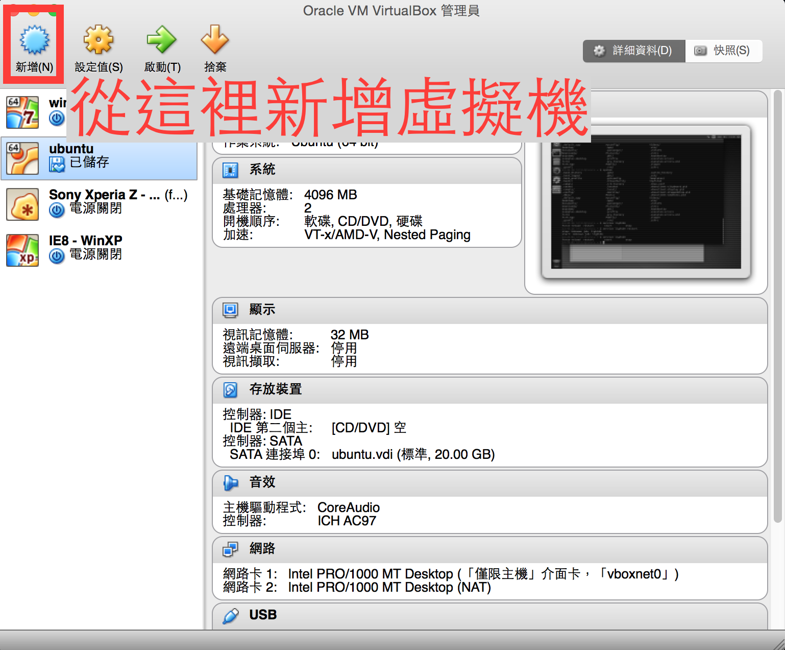
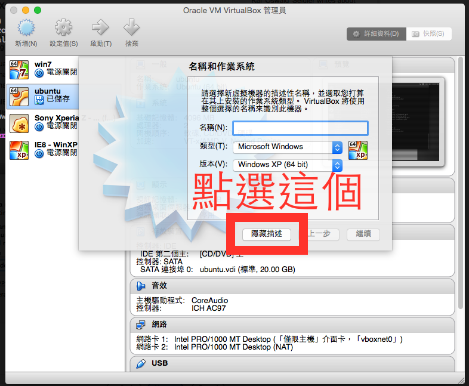
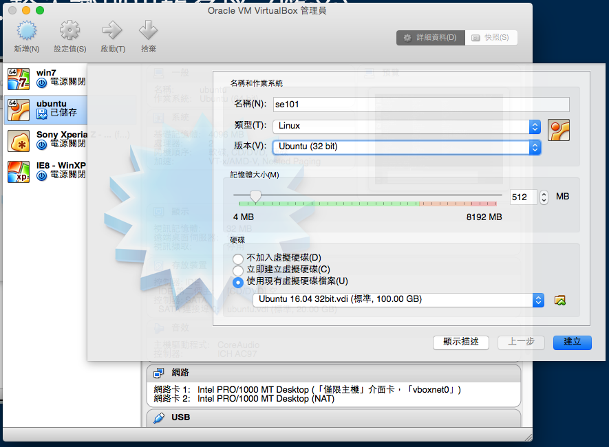

# 架設你的虛擬機

tmt514, Wei, Jimmy

2016.09.27

--

## 線上虛擬機服務

(皆需要信用卡驗證)

* 我們推薦 [c9.io](https://c9.io)
* [Amozon AWS](https://aws.amazon.com)
* [Microsoft Azure](https://azure.microsoft.com/)
* [Digital Ocean](https://cloud.digitalocean.com/)

--

## Oracle VirtualBox

(免費新方案 = 免費心方案)
  
* 先從這邊[下載 Virtual Box](https://www.virtualbox.org/wiki/Downloads)

--

## 下載映像檔

* 從這個地方下載映像檔
* 檔案很大(超過 4GB)，請務必用 wifi

* [點我下載](https://drive.google.com/open?id=0B8LPV3Vxy585RS1JMmdqa0dSMHM)

--

## 新增虛擬機

* Step 1. 打開 VirtualBox
* Step 2. 選擇「新增(N)」

--

## 新增虛擬機

* Step 3. 展開詳細說明

--

## 新增虛擬機

* Step 4. 選擇虛擬硬碟檔

--

# 然後就可以啟動了！
