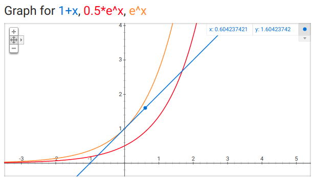

UMTW-SE101 Fall 2018

## 動態規劃《組合數學篇》

<!-- .element: style="height:400px" -->

--

## 跟大家聊一些數論

Number Theory

--

### 一些符號和定義

* 整除、因數與倍數：`$a|b$`
* 質數：`$p\in\mathbb{N}$` is _prime_ if `$d|p \Leftrightarrow d=\pm 1, \pm p$`
* 最大公因數：`$\gcd(a, b) := \max_d \{d\ :\ d|a, d|b\}$`
* 互質：`$a\perp b$` if `$\gcd(a, b)=1$`
* `$d(n)=|\{d\ :\ d\in\mathbb{N}, d|n\}|$`
* `$\pi(n)=|\{\text{prime } p\ :\ p\le n\}|$`
* `$\varphi(n)=|\{d\ :\ 1\le d\le n, d\perp n\}|$` （歐拉函數）
* `$\zeta(s) = \sum_{n=1}^\infty 1/n^s$` （黎曼函數）

--

### 暖身暖起來

* [Leetcode 300. Longest Increasing Subsequence](https://leetcode.com/problems/longest-increasing-subsequence/description/)

<!-- .element: style="float:right;height:300px" -->

--

### 真正的暖身

* [Leetcode 368. Largest Divisible Subset](https://leetcode.com/problems/largest-divisible-subset/description/)

<!-- .element: style="float:right;height:300px" -->

--

### 真正的數論

* [Leetcode 204. Count Primes](https://leetcode.com/problems/count-primes/description/)

<!-- .element: style="float:right;height:300px" -->

--

### 篩法 Sieve of Eratosthenes

* Time Complexity:  
    `$$ \begin{align*}
    n + \frac{n}{2} + \frac{n}{3} + \cdots + \frac{n}{n} 
    &= \sum_{k=1}^n \frac{n}{k} \\
    &= n H(n)\\
    &= \Theta(n\log n)\\
    \end{align*} $$`
* 嗎？

--

### 篩法複雜度

`$$ n + \sum_{p\le n,\ p \text{ is prime}} \frac{n}{p} = O(n\ln n)$$`

<!-- .element: style="float:right;height:200px" -->

--

### 篩法複雜度

`$$ n + \sum_{p\le n,\ p \text{ is prime}} \frac{n}{p} = \Theta(n\ln \ln n)$$`

<!-- .element: style="float:right;height:200px" -->

--

### 生猛恆等式

`$$ \begin{align*} \zeta(s) & = \sum_{k} \frac{1}{k^s}\\
& = \prod_{p} \left(1 + \frac{1}{p^s} + \frac{1}{p^{2s}} + \frac{1}{p^{3s}} + \cdots \right)\\
\end{align*}$$`

* 舉例：  
  `$ 1+\frac12+\frac13+\cdots+\frac{1}{20}$`  
  `$\le 
  \left(1+\frac12+\frac14+\frac18+\frac1{16}\right)
  \left(1+\frac13+\frac19\right)
  \left(1+\frac15\right)
  \left(1+\frac17\right)$`  
  `$\ \ \ \, \left(1+\frac1{11}\right)
  \left(1+\frac1{13}\right)
  \left(1+\frac1{17}\right)
  \left(1+\frac1{19}\right)
  $`

--

### 一生受用不等式

* `$ \forall x\in \mathbb{R}:  1+x \le e^x$`
* `$ \forall x\in [0, 1]: 1+x \ge \frac{1}{2} e^x$`

--

### 下界

`$\begin{align*}
\sum_{k\le n} \frac{1}{k} & \le \prod_{p \le n} \left( 1 + \frac{1}{p} + \frac{1}{p^2} + \cdots \right) \\
& = \prod_{p \le n} \frac{1}{1-1/p} 
= \prod_{p \le n} \left(1 + \frac{1}{p-1}\right) 
\le \prod_{p \le n} \left(1 + \frac{2}{p}\right) \\
& \le \prod_{p \le n} e^{2/p} = \exp\left(2\sum_{p\le n} 1/p\right)
\end{align*}$`<!-- .element: style="font-size:60%" -->

所以 `$\sum_{p\le n} \frac{1}{p} \ge \frac{1}{2} \ln H(n) \approx \frac{1}{2}\ln\ln n$`.

--

### 上界

`$\begin{align*}
\sum_{k \le n^2} \frac{1}{k} & \ge \prod_{p\le n} \left( 1 + \frac{1}{p} \right) \\
&\ge \prod_{p\le n} \frac{1}{2} e^{1/p} = \frac{1}{2}\exp\left( \sum_{p\le n} \frac{1}{p} \right)\\
\end{align*}$`<!-- .element: style="font-size:60%" -->

所以 `$\sum_{p\le n} \frac{1}{p} \le \ln (2H(n^2)) \approx \ln\ln n$`.

--

### 『線性』時間篩法

* 面試不會考。

<!-- .element: style="float:right;height:300px" -->

--

### 最後的暖身

* [Leetcode 878. Nth Magical Number](https://leetcode.com/problems/nth-magical-number/description/)
* [Leetcode 319. Bulb Switcher](https://leetcode.com/problems/bulb-switcher/description/)

--

### 數論如何幫助計算

* [Leetcode 279. Perfect Squares](https://leetcode.com/problems/perfect-squares/description/)

--

### 四平方和定理

* （高斯＋拉格朗日）任何正整數 $n$ 都可以表示成不超過 4 個整數的平方和。而且，需要 4 個整數的時候若且唯若 $n$ 形如 $4^r(8k+7)$。
* 參考資料 https://arxiv.org/pdf/1108.6246.pdf 

--

<!-- .slide: data-background="#ABD" -->
### 動態規劃的重點

1. 定義遞迴函數。
2. 找出遞迴關係。
3. 確定邊界條件。

--

<!-- .slide: data-background="#ABD" -->
### 組合數學 in 動態規劃 der 核心概念

* Counting: 計數方法（加法原理、乘法原理、組合數）
* Recursive Formulation: 遞迴方法（這跟動態規劃一樣）
* Mapping: 對應方法（找出對應題目本質的組合解釋）

