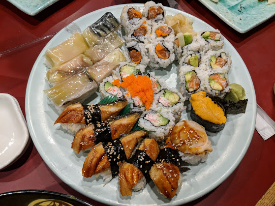

UMTW-SE101 Fall 2018

### 動態規劃《邁向優化之路》

<!-- .element: style="height:400px" --> 
<small>賣相優化食物</small>

--

<!-- .slide: data-background="#ABD" -->
### 動態規劃的重點

1. 定義遞迴函數。
2. 找出遞迴關係。
3. 確定邊界條件。

--

<!-- .slide: data-background="#ABD" -->
### 關於優化 Optimization

1. 狀態轉移很花時間？
2. 狀態總數太多？
3. 是否有別的解法？(e.g. Greedy Alg)

--

### 經典的方法們

* Candidate set doesn't change much: data structures. (min/max)
* [Monotonicity & Quadrangle Inequality.](https://pdfs.semanticscholar.org/edb4/974d6c9240c5b833d166c7f1a3e4d8d5f7f7.pdf)
* [High Speed Linear Recursion](http://zsinf.org/HSLR/)

--

### 經典的題目們

* [Optimal Binary Search Tree](https://www.geeksforgeeks.org/optimal-binary-search-tree-dp-24/)
* [郵局設置問題](http://poj.org/problem?id=1160)
* [消方塊問題](http://poj.org/problem?id=1390)
* [Tower of Hay](http://tjsct.wikidot.com/usaco-open09-gold) [(Analysis)](http://contest.usaco.org/TESTDATA/OPEN09.tower.htm)
* [有限制數量背包](https://tioj.ck.tp.edu.tw/problems/1387)
* [土地購買問題](http://tjsct.wikidot.com/usaco-mar08-gold)
* [Minimum Number of Rooks](https://icpcarchive.ecs.baylor.edu/external/21/p2178.pdf)