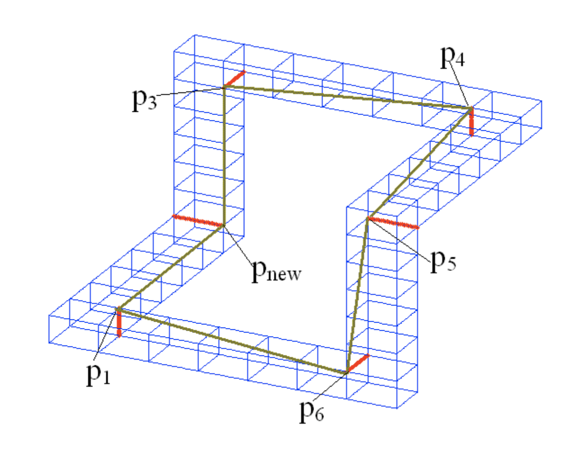

UMTW-SE101 Fall 2018

### 動態規劃《計算幾何篇》

<!-- .element: style="height:400px" --> 

--

<!-- .slide: data-background="#ABD" -->
### 動態規劃的重點

1. 定義遞迴函數。
2. 找出遞迴關係。
3. 確定邊界條件。

--

### 計算幾何

* 用電腦處理**歐幾里得空間**中發生的各種事情XD

--

### 基礎建設

* 點 Points
* 線段 Segments
* 平面 Plane
* 圓 Circle

--

### 向量 Vectors

* 如何計算兩條線段的交點？

<!-- .element: style="float:right; width:150px" -->

--

### 兩個線段交點

* 面積法：`$\overline{P_1O}:\overline{OP_2} = \triangle P_1P_4P_3 : \triangle P_2P_3P_4$`

<!-- .element: style="float:right;width:300px" -->

--

### 有向三角形與有向面積

<!-- .element: style="float:right;width:200px" -->

--

### 簡單多邊形 Simple Polygons

* Q: 如何判斷儲存的多邊形是「順時針序」還是「逆時針序」？

<!-- .element: style="float:right;width:150px" -->

--

### 凸包 Convex Hulls

<!-- .element: style="float:right;width:200px" -->

--

### 凸包的若干算法

* [賈維斯散步 Jarvis' March](https://en.wikipedia.org/wiki/Gift_wrapping_algorithm)
* [葛拉罕掃描法 Graham's Scan](https://en.wikipedia.org/wiki/Graham_scan)
* 上包和下包法 (Double Hull)
* [橡皮筋縮放法(物理)](https://www.cs.auckland.ac.nz/~rklette/talks/07_Kolkata.pdf)
* 分而治之法 (QuickHull)

 <!-- .element: style="float:right;width:200px" -->